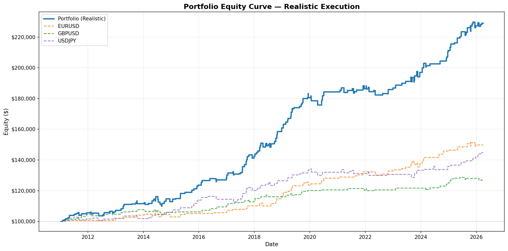
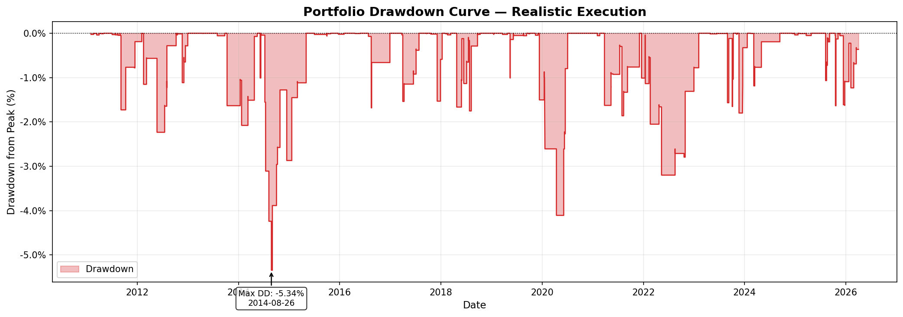
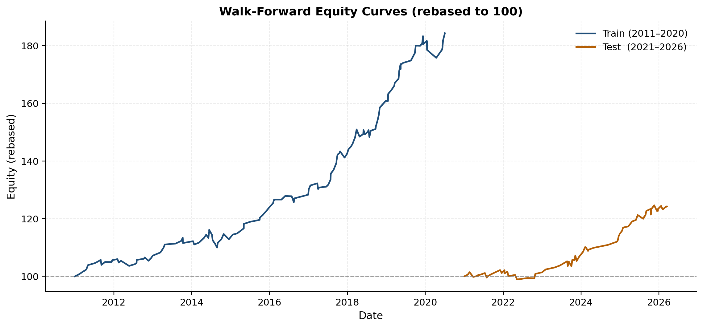
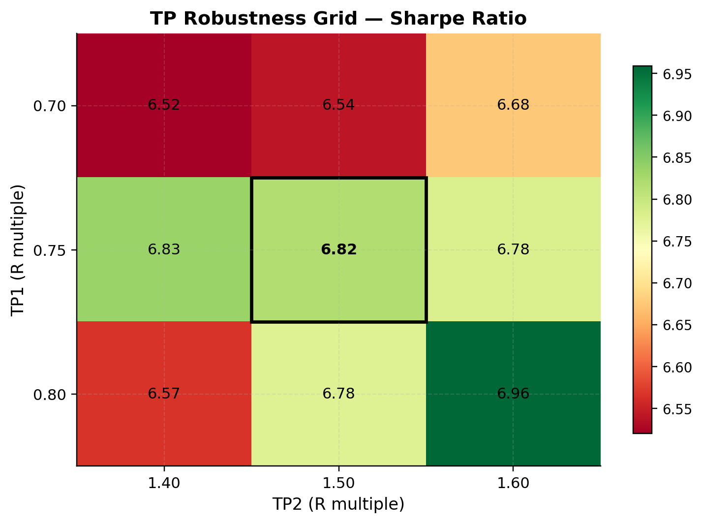

# Quant Trading System — Intraday FX Strategy

A fully systematic intraday FX trading strategy with realistic execution modeling, portfolio-level risk management, and rigorous out-of-sample validation.

Unlike most backtests, this system explicitly models **spread, stochastic slippage, and shared capital constraints**, producing results that better approximate live trading conditions.

---

## Architecture Overview

1m Data → Resampling → Signal Engine → Backtest → Portfolio Simulator → Results

---

## Key Results

Tested on **15 years of intraday data (2011–2026)** across **EURUSD, GBPUSD, and USDJPY**.

**Realistic Execution:**
- Return: **+136.71%**
- Sharpe Ratio: **1.60**
- Max Drawdown: **-5.36%**

**Worst-Case Execution (2× spread + slippage):**
- Return: **+62.97%**
- Sharpe Ratio: **0.867**
- Max Drawdown: **-8.74%**

Returns are generated from a moderate trade frequency (~170 trades total) with controlled per-trade risk (1–1.5%), resulting in steady compounding rather than high-frequency overfitting.

---

## Performance

### Equity Curve


### Drawdown


---

## Validation (Out-of-Sample)

### Walk-Forward Performance

Walk-forward validation evaluates the strategy on unseen data using parameters fixed from prior periods.

Performance remains positive across all out-of-sample segments, supporting robustness and reducing the likelihood of overfitting.



---

## Parameter Robustness

The heatmap below shows Sharpe ratio sensitivity across nearby TP parameter combinations.

Performance remains stable across the parameter grid, indicating low sensitivity to precise parameter selection.



---

## Strategy Overview

The strategy combines three components:

- **Multi-timeframe trend alignment** (1H + 4H)
- **Momentum confirmation** (15m break of structure)
- **Pullback entries** via price imbalance zones (5m)

Entries are executed via limit orders into short-term inefficiencies, improving risk-reward by reducing entry distance to structural invalidation.

A two-stage exit model:
- **TP1 @ 0.75R** → partial profit (60%), stop moves to breakeven
- **TP2 @ 1.5R** → full exit (remaining 40%)

This creates an **asymmetric payoff profile** while eliminating downside risk after partial profit.

---

## Portfolio Construction

- Trades executed across three pairs using **shared capital**
- Position sizing scales with portfolio equity
- **5.5% open-risk cap** limits total exposure

Trades are processed chronologically at the event level, ensuring equity is updated before new positions are sized.

This produces more realistic portfolio behavior than independent per-pair backtests.

---

## Technical Features

- Deterministic event-driven backtesting engine
- Realistic execution modeling (spread + stochastic slippage)
- Portfolio simulation with shared capital and risk constraints
- Walk-forward validation and parameter robustness testing

---

## Project Structure

- `/src` — core backtesting and simulation engine
- `/docs` — research papers
- `/results` — charts and performance outputs

---

## Architecture Overview

1m Data → Resampling → Signal Engine → Backtest → Portfolio Simulator → Results

---

## Papers

For readers who want more detail, the project includes both a concise summary and a full technical research paper covering methodology, validation, and results.

- **Condensed Paper (5–8 min read):**  
  [Condensed Paper](docs/condensed_paper.pdf)

- **Full Research Paper (Technical):**  
  [Full Research Paper](docs/full_paper.pdf)

---

## Key Insights

- Strategy performance is strongly **regime-dependent**, with highest returns during sustained directional (trending) market conditions  
- **Execution costs (spread + slippage)** materially reduce Sharpe ratio, highlighting the importance of realistic modeling in intraday strategies  
- **Asymmetric trade management** (partial TP + breakeven stop) improves win rate and reduces drawdowns by removing downside risk after initial profit  
- **Portfolio-level risk constraints** (shared capital + risk cap) prevent overexposure during periods of correlated signals across FX pairs  

---

## Limitations

- Performs best in **trending market regimes**; edge weakens in choppy or mean-reverting environments  
- **Sensitive to execution costs**, particularly in lower-liquidity conditions or wider spreads  
- Limited to **three major FX pairs** (EURUSD, GBPUSD, USDJPY); may not generalize to other assets  
- Does not model **latency, order book dynamics, or market impact**  
- Strategy performance may vary under **different broker conditions or execution environments**  

---

## Takeaway

The strategy’s edge is driven by **selective participation in structurally aligned momentum regimes**, rather than prediction.

This is combined with **asymmetric trade management**, which locks in partial gains while eliminating downside risk after TP1, creating a favorable risk-return profile.

At the portfolio level, **risk constraints and dynamic position sizing** stabilize performance and prevent overexposure, making results more representative of real trading conditions.

---

## How to Run

```bash
git clone https://github.com/cbaumann0912-prog/quant-trading-system.git
cd quant-trading-system
pip install -r requirements.txt
python src/run_portfolio.py
