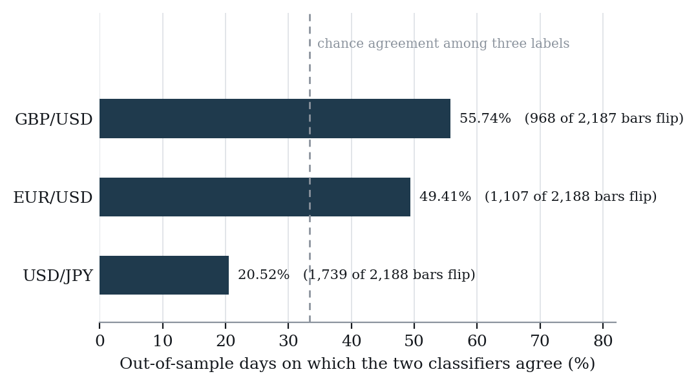
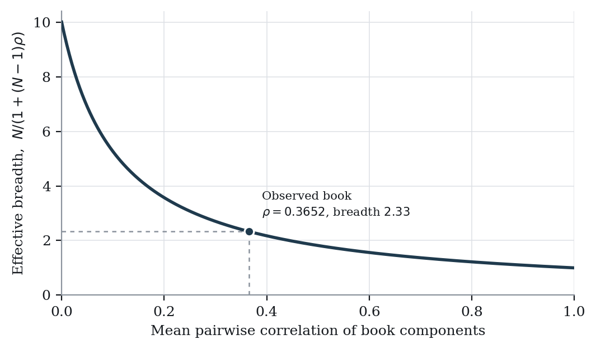
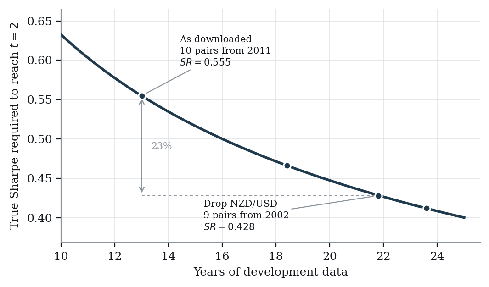

# Underpowered by Design: Six Pre-Registered Null Results in Systematic FX Research

*Cornell Engineering, Summer 2026. Single author. All results computed on 1-minute FX data, 2 January 2011 to 29 December 2023.*

---

## Abstract

I pre-registered six strategy hypotheses in writing and tested them against thirteen years of 1-minute data on ten currency pairs. All six closed as invalidated. The reserved 2024–2026 holdout was never used to evaluate anything.

The nulls are not the contribution. Section 5 is: four failure modes that were instrumented and measured on this program as they happened, rather than described from outside one.

The last of them names a design error I made before the first test ran. I chose ten pairs for breadth without checking what breadth cost in calendar span. Dropping one pair would have bought 8.8 years and moved the Sharpe needed for t = 2 from 0.555 to 0.428, which is the difference between a study that could resolve its own effect sizes and one that could not.

---

**Data and code availability.** Every figure in this paper is produced by a script in a public repository at `github.com/cbaumann0912-prog/quant-trading-system`, with dependencies pinned and a Docker image that fixes the interpreter. The 1-minute bars are commercial vendor data and are not redistributed here; Appendix D gives the reproduction procedure and the two caveats that attach to it.

---

## 1. Introduction

This paper reports a research program that produced no strategy.

Six hypotheses were written down before any of them was tested. Each specification fixed the hypothesis, the economic rationale, the entry and exit logic, the sizing and risk controls, and the conditions under which the strategy would be declared dead. Each was then tested and each failed. A slice of data from 1 January 2024 onward was reserved for one unbiased evaluation of whatever survived. Nothing survived, so it was never opened.

So what is that outcome evidence about? Six failures could mean six bad hypotheses. They could equally mean one badly designed study run six times. The two readings point in opposite directions: better hypotheses in the first case, a different study in the second.

I want to argue for the second, and the arithmetic in §5.4 is what gets you there. Thirteen years of data needs a true Sharpe near 0.55 before an estimate clears t = 2, and sampling those same thirteen years every minute rather than every day does not move it. Five of the six candidates failed at effect sizes this sample could not have resolved even if they were real. The study was underpowered before it began, and it was underpowered because of a universe choice nobody costed.

That changes what §4 is worth. The verdicts are real, each reached against criteria fixed in advance, but a verdict from a test that could not have detected the effect tells you mostly about the test. What survives the power problem is §5, because each of those four results is a property of the design rather than of the sample size.

### Positioning

Each of these failure modes is already documented. What I can add is narrower: a complete pre-registered program where they were instrumented and measured as they happened, including two that the protocol itself never caught.

Harvey, Liu and Zhu collect 316 factors from the published literature and argue that a new factor needs a t-ratio above 3.0 rather than the conventional 2.0, given how much searching sits behind the record. Their sharpest line for my purposes is about what that record cannot show: "we do not observe the factors that were tested but failed to pass the usual significance levels." This paper is a small piece of the complementary record.

Bailey, Borwein, López de Prado and Zhu formalise how fast a search over configurations manufactures an in-sample result with zero expected out-of-sample Sharpe. Their Theorem 1 gives a minimum backtest length as a function of configurations tried, and the illustration is stark: with five years of data, trying more than 45 independent configurations makes an in-sample Sharpe of 1 with an expected out-of-sample Sharpe of zero close to guaranteed. Section 5.4 is the same trade from the other side, asking not how many configurations a fixed sample supports but how much sample a fixed effect size demands.

Bailey and López de Prado introduce the deflated Sharpe ratio, correcting for selection bias under multiple testing and for non-normal returns, and the process rule I adopted is theirs: not controlling for the number of trials behind a discovery leads to over-optimistic expectations. My count is cumulative across the roster and includes failed tests, and §3 records one trial that should have entered it and did not.

Lo derives the distribution of the Sharpe ratio and shows that annualizing by the square root of the sampling frequency holds only under restrictive conditions, the error reaching 65% in his hedge-fund example once serial correlation is accounted for. That lands twice here: in §2, where every annualization factor is computed from a series' own index, and in §6, where the surviving book's returns turn out to be dependent at a horizon my block bootstrap does not cover.

One author, one retail data vendor, no replication, and nobody else has read the code that produced any number here. That bounds some claims and not others. The failure modes in §5 are properties of the design and the arithmetic rather than of the vendor, which is why §5.1 in particular survives it: that comparison holds the inputs fixed on both sides.

---

## 2. Data

### Source and coverage

Ten currency pairs of 1-minute OHLCV bars: EUR/USD, GBP/USD, USD/JPY, USD/CHF, AUD/USD, USD/CAD, NZD/USD, EUR/GBP, EUR/JPY and EUR/CHF. The development sample runs from 2 January 2011 to 29 December 2023, 12.99 years, and holds 47,287,601 minute bars. Timestamps are local-time-naive, formatted `%Y%m%d %H%M%S`.

| Pair | Minute bars | Daily closes | Flat bars | Duplicate stamps |
|---|---:|---:|---:|---:|
| EUR/USD | 4,766,619 | 4,056 | 1.49% | 300 |
| GBP/USD | 4,759,785 | 4,055 | 1.51% | 300 |
| USD/JPY | 4,700,657 | 4,056 | 2.12% | 300 |
| USD/CHF | 4,722,674 | 4,055 | 3.29% | 299 |
| AUD/USD | 4,749,069 | 4,055 | 1.76% | 300 |
| USD/CAD | 4,691,825 | 4,055 | 2.49% | 299 |
| NZD/USD | 4,715,513 | 4,055 | 2.49% | 300 |
| EUR/GBP | 4,725,060 | 4,055 | 1.96% | 300 |
| EUR/JPY | 4,782,753 | 4,056 | 0.55% | 300 |
| EUR/CHF | 4,673,646 | 4,055 | 3.65% | 300 |

: Table 1. Development sample coverage by pair, 2 January 2011 to 29 December 2023.

Coverage is continuous. The largest gap between consecutive daily observations is 3 days in every pair, which is ordinary weekend closure, and nothing anywhere exceeds 4. Across all 47.3 million bars there are no missing closes, no non-positive prices, and no bars that violate the OHLC ordering constraints.

Eight three-month interbank rate series accompany the prices, one each for the United States, euro area, United Kingdom, Japan, Switzerland, Canada, Australia and New Zealand. They are monthly, not daily: 156 observations apiece over 2011-01 to 2023-12. A carry or rate-differential factor built from them inherits that frequency, and a monthly rate aligned onto a daily price panel is a step function.

### Three hard limits

Volume is identically zero in all 47,287,601 rows across all ten files. No volume-based feature is constructible here and none is used.

No bid or ask is recorded. Each bar carries one price series, so every transaction-cost figure in this paper rests on assumed ECN spreads. I have not measured a spread anywhere in this study.

Timestamps duplicate across daylight-saving transitions. Each pair holds 299 or 300 duplicated minute stamps, all of them in October of 2019 through 2023. The stamps carry no timezone, so the repeated autumn hour appears twice. Daily resampling collapses these silently, but they stay a live concern for the intraday work in §4.6, which reads minute bars directly.

Between 0.55% and 3.65% of minute bars are flat, high equal to low. Those cluster in thin sessions and, for EUR/CHF, in the Swiss National Bank floor period. That pair is the highest in the universe at 3.65% overall, with flat shares of 7.00% in 2012 and 7.55% in 2014 against 1.75% to 3.62% in every year from 2015 on. Flat bars are kept rather than filtered.

### Resampling and the evaluation window

Statistical work outside §4.6 runs at daily frequency. Minute bars are resampled by last observation within each calendar day, dropping empty days, which gives 4,055 or 4,056 daily closes per pair. Aligned across all ten the panel is 4,056 rows from 2011-01-02 to 2023-12-29 with 7 missing cells, and complete-case daily log returns number 4,053.

Returns are log differences of consecutive daily closes. Log returns add across time, which is what lets me aggregate over arbitrary lookback and holding windows by summation, and they sit closer to normal for small daily FX moves. Where returns have to be aggregated across pairs at a single date instead of across time I use simple returns, since log returns do not add across a portfolio.

My evaluation window is 2011-01-01 to 2023-12-31. An earlier draft named 2015–2022; that window describes no result in this study and is gone. Twenty-six research scripts carry `DEV_END = "2023-12-31"` as a module constant with `START = "2011-01-01"` alongside it, and every verdict in §4 was computed on that range.

### The Sunday session, and two annualization factors

FX trading opens at 17:00 ET on Sunday. Median minute-bar counts per calendar day are 1,435 on Monday, 1,437 Tuesday through Thursday, 1,020 on Friday and 416 on Sunday, with no Saturday bars. Daily resampling therefore emits a Sunday observation built from about a seven-hour session, 671 to 672 such bars per pair, 16.5% to 16.6% of the daily sample. They behave as their length implies. On EUR/USD the mean absolute daily log return is 0.00159 on Sunday bars against 0.00319 to 0.00428 on weekdays.

Every pair's daily index consequently gives an empirical annualization factor of 312.19 or 312.27 for every pair, against the 260.57 a weekday-only index would produce. I annualize using the factor computed from each series' own index rather than any fixed convention.

The larger factor is not a bias. Dropping Sunday bars does not remove the Sunday price move; it merges that move into the Friday-to-Monday return, and annual variance is a sum of per-period variances that does not care how the year is partitioned. So σ√K estimates the same annual volatility either way: annualized Sharpe comes out −0.1719 including Sunday bars and −0.1776 excluding them, a ratio of 0.97, and the remaining three percent is serial dependence rather than session structure, an instance of Lo's result that √K annualization is sensitive to autocorrelation. What the empirical factor buys is protection from a fixed constant: annualizing the same series with a hardcoded 252 gives −0.1544 against the measured −0.1719, a discrepancy with nothing behind it.

Two different factors appear in this paper and the distinction matters. The daily panel measures 312.19–312.27 observations per year because the vendor buckets the Sunday open as its own date. The intraday session book of §4.6 measures 259.44 sessions per year over the same 12.99 years, because that strategy trades one 09:00–13:00 session per weekday and never touches the Sunday stub. Neither corrects the other. They describe two observation streams drawn from the same bars, each computed from its own index, and applying either to the other's returns misstates the annualized Sharpe by roughly 10%. That is the kind of error that survives review because both constants look plausible.

### Embargo, purging, and overlapping outcomes

Walk-forward evaluation enforces a directional gap between the end of each training window and the start of the matching test window. The embargo is 5 rows of the resampled daily index throughout, sized to exceed the longest feature lookback so no test-set feature can read training data; weekends are already dropped, so an embargo "day" here is a row rather than a calendar day. The gap runs one way, since features are causal and the leakage risk only runs forward.

A second channel comes from the target. Forward returns over h bars look forward by construction, so for the final h bars of any test window the target price sits past the boundary. Those observations are masked rather than scored, and every scored bar resolves its full holding horizon inside its own test window. Overlapping forward returns are the limitation I did not escape: consecutive h-bar returns share h−1 bars, so the effective number of independent observations in a window of n scored bars is roughly n/h. Section 4.2 shows what ignoring that costs.

### Reserved holdout

Everything from 1 January 2024 onward is reserved for one unbiased evaluation of a strategy that has already survived every development test. No research script reads it, no strategy was evaluated or selected on it, no parameter was fit to it, and no result in this paper is computed on it. It opens only on a PASS, and six candidates failed without it opening, which leaves one clean out-of-sample test unspent.

Keeping it sealed through six failures deserves a sentence, because the opposite instinct is strong. Opening the holdout to confirm a failure spends the only unseen data in the project and buys nothing, since the strategy is already dead by its own criteria. Worse, it creates a live temptation: if the confirmation came back positive by chance, I would be left holding a dead strategy with a flattering out-of-sample number attached and no clean way to discount it afterwards.

One qualification belongs on the record even though it is now closed. Until late in the project four real-data tests parsed the raw files with no end date, so the test suite computed on the reserved rows every run. All four are numerical-equivalence checks, a Johansen trace test against the hand-derived eigenvalue problem and three comparisons of the `scipy` Markowitz solution against the closed-form KKT solution, so nothing was ever selected, fitted or evaluated on that data. But the claim as I originally wrote it was stronger than the code supported. Those tests are now bound to the development window like every research script. What stays true of the whole project is that reading a file loads all of its rows before a date filter applies, and no computation anywhere uses a row dated after 29 December 2023.

---

## 3. Research design

### Pre-registration

Each strategy has a specification written before any test was run, in twelve fixed sections: hypothesis, economic rationale, prior evidence, signal definition, entry, exit, sizing, risk controls, cost assumptions, the falsification battery, the failure conditions, and the verdict rule. Appendix A reproduces all six verbatim. Their bodies are unedited apart from one figure in strategy 5's, which cited another day's condition number wrongly and is corrected with a dated note inside the document itself; the status line is amended on closure.

Section 11, which names the conditions under which the strategy is declared dead, is the one doing the work. Fixing those in advance is what turns a disappointing result into a verdict instead of a reason to keep looking. Section 5.3 reports two cases where that machinery ran exactly as designed and still produced the wrong answer, because the conditions themselves could not discriminate.

### The seven-stage pipeline

1. Pre-registration, as above.
2. Power gate. `compute_required_sample_size` and `compute_achieved_power` run before data is touched. If the sample cannot resolve the effect size the hypothesis implies, the hypothesis is not tested.
3. Signal construction. `SignalBuilder` takes any `signal_fn(data, lookback) -> pd.Series` under a causal-by-convention contract, with `validate_no_lookahead` as a mechanical check. That check is a falsification test; passing it does not certify the absence of leakage.
4. Walk-forward validation. Expanding or rolling windows, with every fit refit inside the training window, regime classifiers and volatility models included. Purged cross-validation with overlap purging and embargo is the research tool and walk-forward is the deployment-realistic backtest. They are not substitutes.
5. Statistical validation. Permutation tests, block-bootstrap intervals that respect serial dependence, deflated Sharpe, and Benjamini-Hochberg correction applied across the whole roster rather than within one strategy.
6. Cost gate. Round-trip spread, rollover and implied trade count against a breakeven Sharpe.
7. Verdict, documented either way, with the failure mode named.

### Trial counting

Trials are counted cumulatively across the roster, failed tests included. Benjamini-Hochberg in §5 uses 6, one per strategy.

It is not complete, and I would rather record the gap than quietly repair it. Strategy 1's entry threshold was picked from four candidate levels (§4.1). Under my own rule that is a researcher degree of freedom and belongs in the count, and it never entered. The omission moves no published p-value, but for an accidental reason rather than a defensible one: the threshold rule was drafted and then bypassed, so it produced no test statistic for a larger count to correct. Strategy 4b's audit separately logs roughly 26 window, lookback, regime and universe configurations explored in one session-variant pass, best of them t = +0.89. That exploration sits in the repository and is likewise not in the roster count.

### Process failures

Four departures from the intended discipline belong in the record.

My specification deadline slipped by eleven days. The plan called for a written one-page specification per candidate by day 30, and no specification work is dated to day 30 anywhere in the repository. Specifications for two of the three original candidates were written during a backlog sprint on day 41, and both strategies were tested and discarded the next day.

Strategy 1 never got a specification at all. It came out of principal-component work on days 18–19 and was evaluated through daily audits. Writing one now, with the results known, would produce a document formally indistinguishable from the genuinely pre-registered ones and would corrupt the evidential value of the whole roster. The absence is the honest artifact.

Strategy 4b's specification is still marked draft on sizing and risk. It redeployed an existing leg rather than proposing a new hypothesis, and I never finished it to the standard of the other five.

And the power gate became binding only at day 57, after five of the six candidates had already been tested. It sits at stage 2 of the pipeline above because that is where it belongs, not because it was there from the start. It is the largest process change the six nulls produced and it arrived too late to be any use to the program that produced it. Section 5.4 is the argument for why it should have come first.

### What is computed from scratch, and what is not

Almost all of the statistical machinery is derived and implemented rather than imported, and Appendix B inventories it by package. A short list is called through established libraries instead, and Appendix C names all of it. In every case the imported part is a critical-value table or a solver and the objective function is mine. Two components were originally scoped for first-principles implementation and ended up on that list; they are listed rather than quietly reclassified.

---

## 4. Strategy roster and verdicts

One subsection per hypothesis, each in the same shape: hypothesis, rationale, pre-registered criterion, outcome, what killed it. They are deliberately of similar length. No strategy gets extra space for having a prettier number.

There is no common performance table. The six criteria are heterogeneous by design, and forcing a shared metric would mean re-running each strategy on a basis it was never pre-registered under, which is the move pre-registration exists to prevent.

| # | Strategy | Closed | Criterion that failed |
|---|---|---|---|
| 1 | PC2 Carry Regime | Day 41 | Unconditional and conditional predictability null across three tests |
| 2 | Momentum with ML Regime Filter | Day 42 | Base momentum IC null under two independent methods |
| 3 | OU Half-Life Mean Reversion | Day 42 | Nonlinearity null in all three operationalizations |
| 4 | Vol Regime Breakout / Mean-Reversion | Day 49 | Reversion leg null at p = 0.563; both legs required |
| 4b | Momentum-Only Pooled Book | Day 57 | Robustness null at ten pairs; original pass ran backwards |
| 5 | Month-End FX Rebalancing Flow | Day 57 | Significant with the sign inverted |
| 6 | Intraday Overshoot Reversal | Day 57 | Per-trade permutation and the mechanism test |

: Table 2. The roster, and the pre-registered criterion each candidate failed.

### 4.1 PC2 Carry Regime

Does the second principal component of daily returns on EUR/USD, GBP/USD and USD/JPY predict its own subsequent returns?

All three pairs quote the dollar, so a common dollar move drives all three and the first component recovers it, taking 58.42% of return variance. The second explains 29.22% and loads +0.865 on USD/JPY, +0.474 on GBP/USD and +0.167 on EUR/USD. The yen is the canonical funding currency of the carry trade, so a factor dominated by USD/JPY looks like a proxy for the state of that trade rather than for the dollar. The distribution supports the reading: PC2 scores carry skewness of −1.04 and excess kurtosis of 28.56, and the most negative score at −0.0835 is 2.05 times the size of the most positive at +0.0406, the long-quiet-then-sharp-reversal shape carry unwinds have.

To pass, the information coefficient between the PC2 score and one-day-forward factor-mimicking returns had to reach significance under a permutation test and survive multiple-testing correction across the tests run that day; then, conditionally, so did the interaction term in a regression of forward returns on the score, a volatility regime variable and their product.

Three independent tests, all null. Loadings are fit on training returns to 2020-12-31 and test returns centred on the training mean, leaving 934 aligned observations. Pooled IC is 0.0378 at permutation p = 0.2557. Split by signal sign, the positive subset gives 0.0405 at p = 0.1928 and the negative subset 0.0910 at p = 0.0400, the only sub-threshold value among three exploratory splits, and neither Bonferroni nor Benjamini-Hochberg rejects it. A purged cross-validation comparison found no leakage-inflation artifact. The conditional test, on 909 observations, returns an interaction coefficient of −18.868 at p = 0.365 with R² = 0.0031, and four robustness cells across two regime definitions (0.0693 at p = 0.153, 0.0004 at p = 0.986, 0.0866 at p = 0.070, −0.0477 at p = 0.335) that are unanimously indistinguishable from zero.

What killed it was not the p-values, which are merely unremarkable, but the design that produced them. The interaction regression's condition number is 2.10 × 10¹⁰, past the point where the design matrix counts as near-singular, so its standard errors and the p-values derived from them are numerically unreliable in either direction. A model explaining a third of one percent of forward-return variance, from a near-singular fit, with four unanimous robustness nulls behind it, has nothing in it.


### 4.2 Momentum with ML Regime Filter

Test A asked whether the Spearman information coefficient between a trailing 26-day return and a forward 5-day return is significantly positive on EUR/USD, GBP/USD and USD/JPY. Test B, conditional on A, asked whether a machine-learning regime filter improves it.

Time-series momentum is among the most documented effects in currencies. If it is present at this horizon in these pairs, a regime classifier conditioning on volatility and rate differentials should sharpen it.

Test A was pre-registered as fatal. Test B would not run unless a base effect existed unconditionally, and a pass required p < 0.05 and IC > 0.

Six tests, zero significant, five of six point estimates carrying the wrong sign. Method 1 subsamples every fifth row so no two observations share a forward window, then permutes forward returns 10,000 times: EUR/USD IC −0.0393 at p = 0.2617, GBP/USD −0.0471 at p = 0.1868, USD/JPY −0.0167 at p = 0.6361, all on n = 805. Method 2 keeps all overlapping daily rows and permutes in contiguous blocks of 31, preserving the dependence the overlap induces: EUR/USD −0.0292 at p = 0.3501, GBP/USD −0.0453 at p = 0.1490, USD/JPY +0.0017 at p = 0.9599, on n ≈ 4,024.

With no base effect, Test B was moot. A regime filter cannot condition an effect that is absent unconditionally, and looking for one anyway is the standard route to manufacturing a finding out of noise.

This is also where the overlap correction first earns its place. Comparing each permutation p against the naive Spearman p implied by SE(ρ) = 1/√(n−1): on the non-overlapping subsample the two agree to three decimals on all three pairs. On the overlapping sample GBP/USD gives a naive t of −2.87 and a naive p of 0.0041, conventionally significant, against a block-permutation p of 0.1490. That is an inflation factor of 36.4, and it comes from treating 4,023 overlapping observations as independent when they hold roughly 130 independent windows counted about 31 times each. The non-overlapping arm works as a control: where dependence is removed by construction the two p-values coincide, which rules out the permutation machinery as the source of the gap.

One more thing worth saying. An earlier construction overlapped the trailing and forward windows and returned an IC near +0.30, roughly six times anything seen after the fix. A result that size in daily FX is evidence of a coding error before it is evidence of an anomaly.

### 4.3 OU Half-Life Mean Reversion

Test 1 asked whether the z-scored deviation of price from its rolling moving average mean-reverts at all. Test 2 asked whether large deviations are more reliable entry signals than small ones.

If a price series reverts to a trailing mean with an estimable half-life, the size of a deviation ought to say something about how fast or how reliably it reverts, and a threshold entry can trade that.

I pre-registered the nonlinearity claim in three independent operationalizations, any single failure fatal: reversion time by pool, forward return by pool, and the information coefficient between deviation magnitude and subsequent return.

Test 1 passed and Tests 2, 2b and 2c all failed. On the z-series built from a 100-day moving average and rolling standard deviation, the augmented Dickey-Fuller statistic is −6.1475, −6.1831 and −6.8496 across the three pairs at p ≈ 0, and KPSS fails to reject stationarity at 0.1510, 0.1028 and 0.4076. The two tests agree, which is the stronger form of the conclusion because their nulls are opposite. Fitted OU θ is 0.01953, 0.01966 and 0.02187, giving half-lives of 35.5, 35.3 and 31.7 days.

Test 2, on reversion time, gives differences of −2.390 days at p = 0.6199, +5.023 at p = 0.2679 and −0.006 at p = 1.0000. The signs disagree across pairs and USD/JPY's two pools differ by six thousandths of a day. Test 2b, on 5-day forward return, gives −0.6493% at p = 0.0262, +0.2179% at p = 0.7073 and −0.2461% at p = 0.3874. Test 2c, on the information coefficient, gives −0.2365 at p = 0.0643, −0.0674 at p = 0.6270 and −0.0295 at p = 0.8280.

EUR/USD's Test 2b result is what killed it, and it killed it in an instructive way: significant in the wrong direction. The hypothesis says large deviations earn more. They earn 0.65 percentage points less. Across nine tests the estimates disagree in sign and, where they agree, lean negative.

Two defects here I logged instead of fixing. The block-bootstrap interval on θ is unusable and reported as such, [0.0604, 0.0781] for EUR/USD against a point estimate of 0.0195, an interval that excludes its own point estimate by a factor of three; resampling 20-day blocks injects artificial discontinuities at every join and an OU fit reads those as fast reversion. Separately, the moving-average window search meant to select the parameter swept its grid against minute-indexed prices with no resampling, so a grid intended as 78 to 624 trading days actually swept 78 to 624 minutes. Repeated at daily frequency it still finds no plateau, with the half-life to window ratio staying inside 0.29 to 0.56 across an eightfold range, so the defect did not change the conclusion drawn from it. That is luck, not a defence.

### 4.4 Volatility Regime Breakout / Mean-Reversion

Momentum works better in turbulent volatility regimes and mean-reversion works better in calm ones, so a regime-gated two-leg strategy should beat either leg unconditionally.

Regime dependence in currency return dynamics is documented, and a classifier that identifies the state should let each leg trade only where it works.

Two interaction regressions, pooled across three pairs and all out-of-sample walk-forward folds, with the regime composite refit inside every training fold. A leg passes only if the reliability gate on condition number and variance-inflation factors clears for both the primary and alternate-window fits, the primary interaction p falls below 0.05, the alternate-window fit also falls below 0.05 with the same sign, and a 1,000-permutation dummy shuffle falls below 0.05. Any single null kills the leg, and a strategy-level pass needs both.

Momentum passed everything: primary b3 = −0.00356 at p < 0.0001, alternate window −0.00170 at p = 0.0043 with matching sign, permutation p = 0.0010, condition numbers 4.06 and 4.17 with all variance-inflation factors near 1.00. The reversion leg failed. Primary b3 = +0.00028 at p = 0.56308, and the permutation agrees at p = 0.5485. The alternate-window fit alone reaches significance at p = 0.0006, but the specification requires primary significance regardless. Both fits sit on 6,563 pooled out-of-sample observations.

Both legs are required, so one leg passing kills the strategy; adopting the survivor would be a different, smaller strategy chosen after seeing which half worked. The leg that passed is the subject of §5.3, for reasons that have nothing to do with its p-values.

### 4.5 Momentum-Only Pooled Book

Take the momentum leg from strategy 4, redeploy it as a standalone pooled book across all ten pairs, and see whether it keeps its edge. The leg had passed its own battery, and extending it from three pairs to ten should raise breadth without changing the mechanism. This is a redeployment, not a new trial.

Same battery as strategy 4, applied at ten pairs.

It failed on both counts, the extension and the re-examination. Across ten pairs on 21,873 pooled out-of-sample observations the primary fit gives b3 = −0.00137 at p = 0.000032 and the permutation agrees at p = 0.0010, but the alternate 156-day regime window gives b3 = −0.00030 at p = 0.3992. Any single null kills the leg. Moving the regime window from 78 to 156 days shrinks the coefficient roughly sixfold; at three pairs the same swap shrank it about twofold and held significance. More pairs made the result fragile to one design choice rather than uniformly noisier.

More important is the half that sits in the original three-pair pass rather than the extension: the strategy had passed its criterion while running backwards, which §5.3 takes up. The ten-pair fit reproduces that at −0.0021 against the three-pair −0.0022, and an independently computed information coefficient agrees again at −0.104 and −0.094.

Its specification is also still marked draft on sizing and risk, which I have logged rather than gone back and finished.

### 4.6 Intraday Overshoot Reversal

Intraday price displacement beyond a volatility-scaled threshold during the 09:00–12:00 window overshoots and partially reverts by 13:00, and the effect should be stronger when the displacement happens faster. Fast displacement is likelier to be liquidity demand than information, and liquidity-driven moves revert.

Nine checks: a block-bootstrap p on the book Sharpe, the predicted sign, threshold monotonicity across k ∈ {1.5, 2.0, 2.5}, sign stability and post-break significance across a structural break, a per-trade permutation of the fade direction, a reliability gate, a cost gate at 2.0 pips, Benjamini-Hochberg rank against the roster, and the speed interaction. Any single failure kills it.

It failed on two, on figures regenerated in the project's declared environment. The primary result looks strong, and §5.2 gives those numbers and explains why they are an artifact; the cost gate also cleared comfortably, at 4.54× with a maximum viable round-trip spread of 9.078 pips against a 2.0-pip gate. What failed: the per-trade permutation, which is the test the specification actually named, gives p = 0.1349, with the plain t-test agreeing at t = +1.52, p = 0.1281. The speed interaction gives b3 = −0.0465 at p = 0.679 with Cohen's d = −0.2686, where the prediction was b3 > 0 and significant. The point estimate runs backwards.

A third check, threshold monotonicity, was recorded as a failure when the strategy closed and passes on regeneration. Section 5.3 treats that reversal as a finding rather than a correction.

Either failure would have been enough, but the mechanism one matters more. The specification pre-committed to treating a null speed interaction as fatal to the mechanism story even if the primary hypothesis passed, and a second candidate mechanism, an NYSE-open effect, failed as well. That leaves no working explanation for an effect that was already not clearing its own permutation test.

---

## 5. Four findings

### 5.1 A controlled leakage demonstration

Leakage usually gets argued about rather than measured, because the leaked and unleaked versions of a study are rarely both available. Here they both are, on identical data, identical code and identical fold geometry. The only thing that moves is where the volatility-regime classifier is fit.

Strategy 4's classifier was originally fit once on the full sample and applied across all folds. Refitting it inside each walk-forward training window, which is the correct construction and the one the specification had always called for, changes the out-of-sample regime label on a large share of days. On the three pairs where it was first measured, walk-forward and full-sample labels agree on 49.41%, 55.74% and 20.52% of out-of-sample days, so 44% to 79% of labels flip. In absolute terms that is 1,107 of 2,188 bars on EUR/USD, 968 of 2,187 on GBP/USD and 1,739 of 2,188 on USD/JPY. The same check across all ten pairs gives agreement between 32.2% and 60.8%, so 39% to 68% flip. Both ranges are legitimate: they are the three-pair and ten-pair runs of one procedure. Figure 1 shows the three-pair case against what chance among three labels would give.


{width=95%}

USD/JPY is the worst case. Agreement of 20.52% means the two classifiers disagree roughly four days in five, which is worse than a coin flip among three labels would produce.

Two things make this more than a large number. The disagreement is directional rather than noisy: the leaked fit was systematically undercounting turbulence, and once the classifier is refit properly all three pairs trip the strategy's own pre-registered 40% turbulent-share failure condition, which the leaked version passed. A leak that scattered labels at random would not move a share statistic in one direction. And the classifier's correlation input is itself unstable across folds, with every pair's rho flipping sign at least once and per-window values running from −0.197 to +0.824 on EUR/USD alone. The regime signal was never stable enough to justify one full-sample estimate, and the full-sample fit hid exactly that.

A full-sample fit here is doing more than borrowing a little future information at the margin. Where the quantity being fit is itself regime-dependent, the full-sample estimate averages over the states the strategy exists to distinguish, and the classification that comes out can be worse than uninformative. It can be confidently wrong in the direction that flatters the hypothesis.

### 5.2 Aggregation manufacturing significance

Strategy 6's book is the cleanest instance of an artifact in this project, and I want to be explicit that it is presented as an artifact rather than as the strategy that almost worked.

It pools ten pairs, equally weighted, one trade per pair per triggering session. Its headline numbers are strong: Sharpe +1.0464, block-bootstrap p < 0.00001 on a 21-day block, bootstrap interval [+0.5019, +1.5785], ten of thirteen years positive, both halves of a structural-break split significant at +1.1980 and +0.9555.

Underneath, nothing is significant. No individual pair reaches p = 0.05. The largest |t| among the ten is 1.69, on EUR/JPY. The bootstrap interval on cross-pair mean information ratio is [−0.0011, +0.0551] and includes zero. Two of the ten pairs have negative mean trade returns.

Correlation reconciles the two. Mean cross-pair correlation of the daily book components is +0.3652, so the effective breadth is

    BR_eff = N / (1 + (N − 1) ρ) = 10 / (1 + 9 × 0.3652) = 2.33

{width=95%}


rather than 10, which Figure 2 puts on the curve it sits on. Had the trades been independent within a day, the same per-trade statistics would imply a book Sharpe of +0.4221. The observed +1.0464 is therefore mostly the difference between treating ten correlated series as ten independent draws and treating them as 2.33.

Diversification is a real source of risk-adjusted return and I am not claiming otherwise. The narrower claim is that the p-value is the artifact. A book-level significance test that ignores cross-sectional dependence asks whether the aggregate beat zero given a sample size it does not have, and what it leaves behind is a strategy resting on a directional edge that nothing in the analysis separates from zero.

Two permutation tests say this twice over, and the specification happened to pre-commit to the harder one. Permuting the fade direction per trade gives p = 0.1349. Permuting per day, which preserves which pairs traded together, gives p = 0.0010. The per-day test asks whether the book beats a coin flip; the per-trade test asks whether the direction does. Preserve the cross-pair structure and the book looks decisive. Strip it and the direction does not clear.

Dependence treated as independence is one error, and it shows up at three levels here: the observation level in §4.2, where overlapping returns inflate a p-value 36-fold, the trade level in the permutation split above, and the book level in the breadth calculation. It is the most common way a null result acquires a small p-value.

### 5.3 Criteria that do not test their hypothesis

Both cases below were pre-registered, both read as rigorous, and both issued a PASS on evidence that could not support one. They failed differently, and the difference is the point.

The first case is straightforward: the criterion never tested the sign. Strategy 4's day-48 rule asked whether the interaction coefficient b3 differed from zero and stopped there, and the momentum leg cleared every arm of that battery (§4.4). But the hypothesis was that momentum works better in turbulent regimes, and momentum's total effect inside the turbulent regime is b1 + b3 = +0.0014 − 0.00356 = −0.0022. A +1 momentum reading predicts about −0.22% over 26 days in precisely the regime the strategy trades.

My audit at the time recorded "sign is consistent (negative) across the primary and alternate-window fits" as support for it. The observation was correct and its significance was inverted: the consistency was real and the consistent sign was backwards. The honest description of that pass is that the interaction is reliably non-zero and reliably points the wrong way.

The second case is subtler, and it took two regenerations to show how little the criterion was doing. Strategy 6's threshold check required a monotone ordering of mean returns across three entry thresholds. When the strategy closed, the ladder was +0.149, +0.852 and +0.795 basis points at k = 1.5, 2.0 and 2.5, on 6,708, 3,206 and 1,584 trades. Not monotone, and recorded as a failure.

That check could not have been informative either way, and this part is measured rather than asserted. All three confidence intervals span zero, on the closing run and on both regenerations. The deciding gap between k = 2.0 and k = 2.5 was +0.050 basis points against a standard error of 1.014 when the strategy closed, a t-statistic of 0.05, and is +0.042 against 1.013 now, a t-statistic of 0.04. Per-k standard errors are 0.346, 0.547 and 0.853 basis points now against 0.346, 0.548 and 0.853 then, so the dispersion of this ladder never moved. Only its ordering did. Four trades out of 1,588 flip that ordering, and at an excess kurtosis of +22.5 a handful of extremes decides which way. Year by year the ladder is monotone in 2 of 11 tradeable years.

Then it flipped, twice. Regenerating the trade list from the same raw bars with the same committed code, once on Linux under Python 3.10 and once on the declared Windows and Python 3.12 environment, produces ladders of +0.134 / +0.825 / +0.874 and +0.135 / +0.832 / +0.874 basis points, on 6,697 / 3,202 / 1,588 and 6,706 / 3,211 / 1,588 trades. Both monotone. The criterion passes in both. The strategy verdict is unchanged in both, because any single failure kills it and the per-trade permutation and the speed interaction fail throughout.

One might object that this is just platform noise and says nothing about the criterion. But the arithmetic does not support that reading. The move is four to nine trades in roughly 3,200, and only part of it is the platform: the two regenerations agree with each other on eight of ten pairs and diverge from the closing figures on the same four pairs in the same direction, which rules the linear-algebra backend out for those four. Only two pairs genuinely differ between the two builds, and there the GARCH maximum-likelihood optimum explains it. For the other four nothing in the version history accounts for the difference. The validation script, the signal module, the volatility module, the pinned dependencies and the raw files are all unchanged since the strategy closed, and the pipeline consumes no randomness anywhere between the minute bars and the trade list. The closing figures appear to have come from a state that is not in the history at all, which §6 takes up as its own limitation.

For the criterion itself the consequence is simple. It has now returned FAIL, PASS and PASS on the same hypothesis, the same data and the same rule. It is uninformative in both directions, and the fact that it currently passes demonstrates that more cleanly than its original failure did. A criterion you can flip by regenerating the inputs it was computed from is not measuring the market.

A criterion with no power to discriminate is worse than no criterion, because it emits a verdict that reads as evidence. What should worry a reader is that both of these were caught on re-examination, after the criteria had already been used to close strategies.

One consequence was adopted. A direction requirement went into the verdict rule, and strategy 5 became its first use. Its three-way interaction coefficient is b4 = −1.200 × 10⁻⁴ at p = 0.00093, with a block-bootstrap interval of [−2.52 × 10⁻⁴, −2.03 × 10⁻⁵] at p = 0.024 and a narrow-window robustness check at p = 0.024, on 67,057 pooled observations with a condition number of 48.2 and maximum variance-inflation factor of 1.000. Every criterion passed except the sign, and the prediction was b4 > 0. Under the old rule it would have been a pass.

### 5.4 The power ceiling is arithmetic

The t-statistic on an annualized Sharpe ratio is approximately

    t ≈ SR × √(years)

so thirteen years needs a true Sharpe near 0.555 to reach t = 2 (Figure 3). That is not a modelling choice; it falls out of the estimator's standard error and it does not care what the hypothesis is.

Intraday sampling does not relax it, because sampling the same calendar span every minute rather than every day multiplies observations without multiplying elapsed years, and elapsed years are what the expression contains. Strategy 6 makes the point: an intraday session strategy with 3,211 trades still reaches achieved power of only 0.6419, against a requirement of 1,860 active days where it has 1,279.

That changes what the six nulls mean. Five of the six candidates were untestable at this sample size rather than wrong, and the distinction changes what to do next. A wrong hypothesis should be abandoned. An untestable one should be either abandoned or given a sample that can resolve it, and choosing between those requires knowing which situation you are in.

And the fix was available the whole time. My 2011 start is a download choice rather than a vendor limit, and the vendor carries every pair in the universe well before it. The binding constraint on a common start date across all ten is NZD/USD, available from 2005-08.

| Universe | Pairs | Common start | Dev years | Sharpe for t = 2 | Active days | Adequately powered |
|---|---:|---|---:|---:|---:|---|
| As downloaded | 10 | 2011.00 | 13.0 | 0.555 | 1,278 | no |
| Vendor maximum | 10 | 2005.58 | 18.4 | 0.466 | 1,811 | no |
| Drop NZD/USD | 9 | 2002.17 | 21.8 | 0.428 | 2,147 | yes |
| USD majors only | 6 | 2000.42 | 23.6 | 0.412 | 2,319 | yes |

: Table 3. What each available universe would have cost in breadth and bought in calendar span.

{width=95%}


Active-day counts assume the overshoot book's realised trigger rate and 259.44 sessions per year, reproduced from the project's span-constraint note, which was computed against the strategy's closing figures. The regenerated run of §4.6 gives 1,279 active days against an 80% threshold of 1,860 rather than 1,278 against 1,871. Neither difference moves a row's verdict.

That third row is the one that matters: a 23% reduction in the hurdle, bought by dropping the pair with the shortest history. It moves the overshoot book from roughly 1,278 active days to 2,147 against a requirement near 1,870. The study would have been adequately powered.

Breadth against span is the trade, and §5.2 has already priced the breadth: ten pairs delivered an effective breadth of 2.33. The marginal pair was worth far less than the marginal year, and I set the universe without computing either quantity. That is the design error this paper is named for.

Two caveats keep it from being free, and both are real. Pre-2005 currency markets differ in structure, with electronic execution less dominant, wider spreads and a different participant mix, so a longer sample buys power at the cost of assuming the effect is stable across that change. And retail vendor history that old is lower quality and would need validating for gaps and stale quotes first. Neither caveat rescues the original choice, because neither was the reason for it.

---

## 6. Limitations

Ordered by how much each threatens the conclusions above. The first is §5.4 and is not restated here: the universe was chosen for a breadth it did not deliver, at a cost in span that would have made the study adequately powered. Every null in §4 should be read as conditional on a study that could not have resolved most of them.

Next is that I never observed a spread. Every cost figure in this paper rests on assumed ECN quotes, so strategy 6's comfortable clearance (§4.6) is a wide margin against an assumption rather than against a measurement. Entry slippage is unmeasured throughout and 1-minute closes are not tradeable prices. A cost gate computed against assumed spreads tells you costs are not obviously binding. It cannot tell you they are not binding.

Serial dependence is next, and my block length does not cover it. The overshoot book's daily returns are autocorrelated. Ljung-Box on the 3,369-day series gives p = 0.00053 at 10 lags, p = 0.00075 at 21 lags and p = 0.00091 at 40 lags, which invalidates the naive Sharpe t-statistic outright and is why every significance claim on that book comes from the block bootstrap.

Justifying the block length is where my answer goes partial. I used 21 days. The n^(1/3) heuristic for a block bootstrap of the mean gives 15 at this sample size, so 21 is conservative against that rule. But the measured autocorrelation function exceeds its ±0.0338 band at lags 2, 6, 19, 30, 33 and 34, six exceedances in 40 lags where about two would be expected by chance, three of them past the block length. That lag-by-lag measurement was taken on a rebuild whose trade list differs from the published one by nine trades in 3,211, too small to move an autocorrelation function but stated because it was not recomputed on the published set. Dependence at lags 30 to 34 is not preserved by 21-day blocks, and the resulting error runs toward significance: a block shorter than the dependence horizon manufactures independence the data does not have, which narrows the interval and shrinks the p-value. Read the p < 0.00001 on the book Sharpe as an upper bound on the evidence rather than a measurement of it. Estimating block length from the series' own autocorrelation structure instead of fixing it by hand is the standard remedy and is not implemented here.

Then reproducibility, which is the limitation one of my own results failed outright. No number in this paper has been independently reproduced and nobody else has reviewed the code behind it. Coverage was never measured, so "tests pass" is weaker evidence than it looks, and results are platform-sensitive in places: two of the ten pairs in strategy 6's book produce different trade counts under a different linear-algebra backend, because the volatility model is fit by maximum likelihood.

Worse, strategy 6's closing figures cannot be regenerated from any committed state of the repository, on my own machine or elsewhere, and §5.3 works through what that rules out. Section 4.6 and §5.2 publish the regenerated figures; the closing set is recorded as superseded. An earlier audit in this project found the same defect one level down, in a bootstrap confidence interval drawing from an unseeded global generator. It is the strongest argument in this paper for treating reproducibility as something to test for rather than assume.

Two strategies fall short of the pre-registration standard, both recorded in §3 and neither repaired, because a specification written after the results are known is formally indistinguishable from a genuine one and would devalue the four that are genuine.

Overlapping forward returns discount every per-window estimate in §4 to roughly n/h independent observations, as described in §2, and §4.2 shows what ignoring that costs.

Last is vendor data quality. The three hard limits in §2, zero volume, no bid or ask, and duplicated daylight-saving stamps, bound what can be asked of this data at all.

---

## 7. Conclusion

Six hypotheses, pre-registered and tested, all six closed as invalidated, and a reserved holdout that was never used and remains available for one unbiased test.

None of that is evidence these six strategies do not work. On the arithmetic in §5.4, five were never resolvable on the sample I picked to test them, so their nulls say little about the strategies and a great deal about the study.

What carries over from §5 is not the three failure modes themselves, each of which is documented elsewhere, but where they were caught. All three surfaced on re-examination rather than through the protocol, and the re-examination was discretionary. A protocol that only works when the researcher chooses to go back and look is not finished. Underneath all three sits power, which I treated as a diagnostic to compute after a disappointing result for five candidates running and made binding only at day 57. Reversing that order is the single change most likely to have altered how this program turned out.

For a seventh attempt: the power calculation comes before the hypothesis and applies to the data window as well as the effect size. Fix the required Sharpe first, then pick the universe and span that deliver it. Nine pairs from 2002 is the starting design, with a structural-break test across 2005 as a precondition. Every coefficient criterion carries a direction requirement, and every criterion gets checked for discriminating power before adoption, the test being whether its own confidence intervals could distinguish the outcomes it is supposed to order.

The holdout is still worth one clean out-of-sample test. The temptation to spend it confirming a failure, to check just once whether the null was real, is the exact temptation the protocol exists to remove. That it was never spent is the one process claim here the record fully supports.

# Appendices

## Appendix A — The pre-registrations

Six specifications for seven entries in the roster. Strategy 1 has none, for the reason given in §3: it originated in the day 18–19 factor work and was evaluated through daily audits rather than the spec-first process, and writing one now with the results known would produce a document formally indistinguishable from the genuine ones.

What follows is **excerpted** from the repository rather than reproduced in full. For each specification I keep the header, the Provenance note where one exists, Section 1 (the hypothesis and the binding falsification criteria) and Section 10 (the statistical validation plan and its executed record). Sections 2 through 9, 11 and 12 are omitted: they cover economic rationale, data sourcing, signal construction, entry, exit, sizing, risk controls and judgmental adjustments, and in most of these specifications the later ones say some version of "never designed, moot given discard." The omitted text is not summarised or paraphrased anywhere; the kept text is verbatim.

Sections 1 and 10 are the ones that carry evidential weight, because they are what "pre-registered" has to mean: the conditions for declaring the strategy dead, fixed before the first test, and the record of what happened when those conditions were applied. The specifications are unedited from when they were written; only the status line is amended on closure. The authority for that claim is the git history rather than this copy — `git log --follow` on each file shows the content commit and the status amendment separately, and the full text of every specification is in the repository.


### `research/strategies/s02_momentum_ml_regime/spec.md`


#### Strategy Specification — FX Momentum with ML Regime Filter

**Strategy name:** FX Momentum with ML Regime Filter
**Date drafted:** Day 42 (2026-07-07)
**Status:** **DISCARDED** — Test A (base momentum effect) failed after correcting a window-alignment bug; Claim B (regime-dependence) never reached, moot

---

##### 1. Hypothesis

**Hypothesis:** Currencies exhibiting recent positive (negative) returns tend to continue rising (falling) over a subsequent period — a persistent anomaly (Menkhoff et al.: up to 10% p.a. spread between winners and losers) not explained by standard risk factors. Momentum's predictive power is regime-dependent: it works better in trending macro environments and tends to fail or reverse violently around regime transitions or crowded-trade unwinds. An ML classifier gates exposure based on predicted regime state (trending vs. choppy).

**What would falsify this hypothesis?**

| Test | Question | Result |
|------|----------|--------|
| Test A — Base momentum effect | Is Spearman IC between trailing 26-day return and forward 5-day return significantly positive? (permutation test, tested via two independent methodologies) | **FAILED** — all 3 pairs, both methods |
| Test B — Regime-dependence | Does an ML regime filter improve momentum's predictive power in trending vs. choppy states? | **NOT RUN — moot**, no base effect to condition |

Test A failing was pre-registered as fatal to the base momentum claim, which in turn makes Claim B untestable in any meaningful sense — a regime filter cannot rescue a signal that does not exist unconditionally, and searching for regime-conditional effects in the absence of an unconditional one is a known path to manufacturing spurious findings from noise.

---

##### 10. Statistical Validation Plan — Executed Record

**In-sample testing — results:**

- **Test A** (base momentum effect): Spearman IC between 26-day trailing return and 5-day forward return, tested via two independent methodologies to check robustness to overlapping-window handling.
  - **Initial construction contained a window-alignment bug**: a `.shift(HOLDING-1)` operation was misapplied, causing the "forward return" window to overlap almost entirely with the trailing window (differing by only ~1 day) rather than being genuinely forward-looking. This produced a spuriously large IC (~0.29–0.33, p≈0.00000, all pairs, both methods) that was flagged as implausibly high relative to published FX momentum literature (typically much weaker effects) and investigated before being trusted.
  - **After correction** (explicit cumulative-sum index construction, verified by manual inspection of window date ranges to confirm zero overlap between trailing and forward windows):
    - Method 1 (non-overlapping weekly subsample, n=805/pair): EUR/USD IC=-0.039 (p=0.262), GBP/USD IC=-0.047 (p=0.187), USD/JPY IC=-0.017 (p=0.636)
    - Method 2 (overlapping daily data, block permutation with block_size=31, n≈4,024/pair): EUR/USD IC=-0.029 (p=0.350), GBP/USD IC=-0.045 (p=0.149), USD/JPY IC=+0.002 (p=0.960)
  - **Both methods agree**: no significant positive IC in any pair. **Test A: FAILED.**

**Multiple-testing correction:** N/A — strategy discarded before reaching cross-candidate correction stage. This candidate's null result should still be counted when computing multiple-testing correction across the full three-candidate shortlist, per project rules.

**Deflated Sharpe Ratio:** Not computed — no return-generating signal was built.

**Confidence intervals:** Not computed for this strategy — Test A used permutation-based significance testing directly, no bootstrap CI was needed at this stage.

**Out-of-sample / walk-forward validation:** Not reached.

**Leakage check:** The *corrected* trailing/forward return construction has zero window overlap, confirmed via manual date-range inspection (Section 4). The *initial, buggy* construction had a de facto leakage-like flaw — the "forward" window improperly reused most of the trailing window's own days, which is functionally similar to a lookahead/overlap leakage bug even though it arose from an indexing error rather than a genuine future-information leak. Worth flagging as a general lesson: an implausibly strong initial result (IC ~0.30, well above literature norms) was the signal that prompted the check that caught this.

**Transaction costs / breakeven:** Not reached.

---

### `research/strategies/s03_ou_halflife_mean_reversion/spec.md`


#### Strategy Specification — OU Half-Life Mean-Reversion (Z-Score Threshold)

**Strategy name:** OU Half-Life Mean-Reversion (Z-Score Threshold, PPP-Motivated)
**Date drafted:** Day 42 (2026-07-07)
**Status:** **DISCARDED** — Test 1 passed; Tests 2, 2b, 2c (nonlinearity claim, three independent operationalizations) all failed

---

##### 1. Hypothesis

**Hypothesis:** The deviation of EUR/USD, GBP/USD, and USD/JPY's price from its rolling moving average, normalized by rolling volatility (z-score), mean-reverts over time. Large-magnitude z-score deviations are more reliable entry signals than small deviations, because small deviations are statistically indistinguishable from noise around a slowly-drifting equilibrium, while large deviations more plausibly reflect a temporary dislocation likely to correct. MA window, volatility window, and z-threshold are determined via purged-CV grid search on in-sample data (Section 10); working parameters used for hypothesis testing (100-day MA, 100-day vol window, |z| ≥ 1.5 split) were never carried forward to live-signal optimization, since the underlying hypothesis was falsified before that stage.

**What would falsify this hypothesis?**

| Test | Question | Result |
|------|----------|--------|
| Test 1 — Base existence | Does the z-score deviation series show statistically significant mean-reversion? (ADF rejects unit root, KPSS fails to reject stationarity) | **PASSED** — all 3 pairs |
| Test 2 — Nonlinearity (reversion speed) | Is mean reversion time for large-\|z\| excursions (peak ≥ 1.5) statistically distinguishable from small-\|z\| excursions? (permutation test on the difference in mean reversion time) | **FAILED** — all 3 pairs |
| Test 2b — Nonlinearity (forward return magnitude) | Is mean 5-day signed forward return from peak significantly larger for large-\|z\| excursions than small-\|z\| excursions? (permutation test on difference in means) | **FAILED** — all 3 pairs (2 of 3 wrong-signed) |
| Test 2c — Nonlinearity (forward return rank) | Is there a significant positive Spearman IC between peak \|z\| magnitude and signed 5-day forward return? (permutation test on IC) | **FAILED** — all 3 pairs, all wrong-signed |

Any one of these tests failing was pre-registered as fatal to the strategy as specified. All three nonlinearity operationalizations failed. Per standing research-integrity rules, this is treated as a closed, discarded result — not retuned or retried further.

---

##### 10. Statistical Validation Plan — Executed Record

**In-sample testing — results:**

- **Test 1** (base mean-reversion existence): ADF + KPSS on z-score deviation series. **PASSED** — both tests agree across all three pairs (ADF p ≈ 0.00000, stat -6.76 to -7.51; KPSS p ≈ 0.09–0.10).
- **Test 2** (nonlinearity — reversion time): permutation test, mean reversion time, large (peak ≥1.5) vs. small (peak <1.5) pool. **FAILED.**
  - EUR/USD: n=63, small mean=5.29d, large mean=7.68d, diff=-2.39d (wrong-signed), p=0.620
  - GBP/USD: n=54, small mean=12.05d, large mean=7.03d, diff=+5.02d, p=0.268
  - USD/JPY: n=58, small mean=7.05d, large mean=7.05d, diff=-0.01d, p=1.000
- **Test 2b** (nonlinearity — forward return magnitude): permutation test, mean 5-day signed forward return from peak, large vs. small pool. **FAILED.**
  - EUR/USD: diff=-0.65% (wrong-signed), p=0.026 — significant at 5% in the direction opposite the hypothesis
  - GBP/USD: diff=+0.22%, p=0.707
  - USD/JPY: diff=-0.25% (wrong-signed), p=0.387
- **Test 2c** (nonlinearity — forward return rank): Spearman IC, peak magnitude vs. signed 5-day forward return, permutation test. **FAILED.** All three ICs are negative, i.e. larger excursions rank *lower* on subsequent signed return — the opposite of the hypothesis.
  - EUR/USD: IC=-0.237 (wrong-signed), p=0.064
  - GBP/USD: IC=-0.067 (wrong-signed), p=0.627
  - USD/JPY: IC=-0.030 (wrong-signed), p=0.828
- Significance threshold used throughout: α = 0.05, permutation-based (not parametric), given confirmed fat tails/volatility clustering in this data (Day 4, Day 37 findings).

**n_trials for this hypothesis family: 3** (Tests 2, 2b, 2c) — to be carried forward if any future strategy references this line of research or reuses this z-score construction.

**Multiple-testing correction:** N/A — strategy discarded before reaching cross-candidate correction stage. This candidate's null result should still be counted when computing multiple-testing correction across the full three-candidate shortlist, per project rules (correction applies to the full set tested, not just survivors).

**Deflated Sharpe Ratio:** Not computed — no return-generating signal was ever built; Tests 1–2c operated on the z-score/excursion structure directly, not on realized strategy returns.

**Confidence intervals:** Block bootstrap CI attempted on OU θ (block_size=20) — **result unreliable**, diagnosed as an artifact of block-bootstrap resampling introducing artificial discontinuities at block boundaries, inflating apparent θ in every replicate (bootstrap CI [0.061, 0.078] did not bracket point estimate 0.020). Not used as the basis for any conclusion. Left as an open technical note for any future series with similar autocorrelation structure — appropriate block length likely needs to be ≥ the series' own half-life (~35 days here), consistent with the Politis & White (2004) block-size-selection question already deferred to buffer days (Day 37 audit).

**Out-of-sample / walk-forward validation:** Not reached — strategy discarded at in-sample hypothesis-testing stage, before `WalkForwardValidator`, put off for a later date, would have been relevant.

**Leakage check:** The z-score construction itself (rolling MA, rolling vol) used only trailing data — no leakage in that component. The excursion-based tests (2/2b/2c) were inherently retrospective (require observing the future path to identify a peak and measure outcomes) — valid for hypothesis testing as executed, but this construction could never have been lifted directly into real-time signal logic without modification, which is now moot.

**Transaction costs / breakeven:** Not reached.

---

### `research/strategies/s04_vol_regime_breakout/spec.md`


#### Strategy Specification: Volatility Regime Breakout/Mean-Reversion

**Date drafted:** Day 42 (2026-07-07), finalized Day 43
**Status:** Complete

##### 1. Hypothesis
FX volatility and correlation structure go through genuine regime shifts (Ang & Bekaert, 2002), not continuous scaling of one process. The best trading rule differs by regime: mean-reversion when calm, momentum/breakout when turbulent. A 2-feature classifier (rolling realized volatility + interest rate differential) identifies which regime is active. The vol-index-proxy leg from the original 3-feature design was dropped: no free, historically complete, FX-specific vol index exists.

**Falsification criteria** (pre-registered Day 43):

1. Test statistic: conditional IC of the trading signal within the classifier-identified regime (must be conditional, not unconditional, since the hypothesis is regime-dependence itself).
2. Primary threshold: p < 0.05, uncorrected.
3. Reliability gate (from the Day 41 PC2 failure): interaction regression condition number < ~1e10 (VIF < 10), main effects mean-centered before the interaction term. This strategy needs two such regressions, one per leg (`signal x regime_indicator`), since it has two signals rather than PC2's one.
4. Robustness: primary test + both robustness checks (Section 10) must unanimously agree. Any single null kills the hypothesis.
5. Multiple-testing: final PASS/FAIL must survive Benjamini-Hochberg correction across all 4 strategies tested project-wide. Since the other 3 are already null, a real finding here needs p < 0.0125 (BH critical value, rank 1 of 4) to survive.

##### 10. Statistical Validation Plan
No separate full-sample screening stage. The primary test runs directly inside each `WalkForwardValidator` test fold, out-of-sample from the start.

**Primary test**, two interaction regressions, pooled across walk-forward out-of-sample folds:
- Momentum: `R_{t+26} = b0 + b1*momentum_signal_t + b2*turbulent_dummy_t + b3*(momentum_signal_t x turbulent_dummy_t) + eps_t`
- Reversion: `R_{t+26} = b0 + b1*price_z_t + b2*calm_dummy_t + b3*(price_z_t x calm_dummy_t) + eps_t`

Both mean-centered before the interaction term. `b3` is the term of interest. Forward horizon: 26 trading days, shared across both legs. Reliability gate: condition number < ~1e10 per leg.

**Robustness checks** (both must agree; either null kills that leg):
1. Alternate regime window: re-run with 156 trading days instead of 78.
2. Permutation test: shuffle regime-dummy labels (preserving base rates), rebuild the null for `b3`, 1000 permutations.

**Verdict:** each leg evaluated independently; strategy-level PASS requires both legs to pass. A momentum-only pass is a different strategy, not this one. Subject to project-wide BH correction (Section 1, item 5) before appearing as a PASS anywhere.

**Lockbox holdout:** a recent slice (e.g. 2024-2026) is reserved and never enters the walk-forward folds at all, development or robustness checks. It is opened once, only if this strategy passes everything above and becomes a genuine deployment candidate. This is a single-use test per hypothesis, not another round of tuning; if the lockbox result disagrees with the walk-forward verdict, that disagreement is reported as-is, not explained away.

### `research/strategies/s04b_momentum_only_book/spec.md`


#### Strategy Specification: Momentum-Only, Pooled 3-Pair Book

**Date drafted:** 2026-07-19, post-Day-49 decision (not backdated — see Provenance below)
**Status:** Draft, sizing/risk sections need explicit review before this can clear to deployment-candidate status

##### Provenance — why this isn't a new trial

This is not a new hypothesis. It is a narrower redeployment of one leg of strategy #4 (`volatility_regime_breakout_mean_revert.md`), which failed at the strategy level (Section 10 requires both legs; reversion's primary p=0.563 once the lockbox leak was excluded — see `research/strategies/validation_falsification/vol_regime_two_leg_section10_validation.md`). The momentum leg's test — primary interaction regression, both robustness checks, reliability gate — was pre-registered under that spec and passed blind, before either leg's result was known. Nothing here is evidence generated after seeing what worked.

Consequence: this spec does not reset the project-wide multiple-testing count. `n_trials` stays at 4. It also does not include GBP/USD-only reversion as a companion leg — that idea was generated by looking at per-pair results after the pooled reversion test already failed, and there is no unseen dev data left to test it against (the full pre-2024 range was already used in the Day 43 exploratory pass). It's logged as an open, untested idea in `research/strategies/validation_falsification/vol_regime_signal_report_audit.md`, not deployed here.

##### 1. Hypothesis
Time-series momentum (Moskowitz, Ooi & Pedersen 2012) has a real, regime-conditional edge in FX: `sign(P_t/P_{t-78}-1)` predicts 26-day forward returns specifically when the 2-feature volatility/rate-differential composite classifies the pair as turbulent (`|composite z| > 1.5`). Already tested and passed at the leg level (Day 48).

##### 10. Statistical Validation Plan
No new test is run. Momentum's primary regression, both robustness checks, and the reliability gate already passed under strategy #4's Section 10 (`research/strategies/validation_falsification/vol_regime_two_leg_section10_validation.md`) — reused here, not repeated.

**Open decision, not resolved by this spec:** the lockbox holdout (2024-2026) was reserved for "this strategy," meaning the original 2-leg design. Momentum-only is a redefinition — narrower scope, different sizing/risk assumptions once Section 7 is settled. Whether momentum's already-passed per-leg test is sufficient to treat this as cleared for the lockbox, or whether the redefinition itself needs a full review pass first, is a judgment call to make explicitly before opening it — not something to default into either direction.

### `research/strategies/s05_month_end_fx_flow/spec.md`


#### Strategy Specification: Month-End FX Rebalancing Flow

**Date drafted:** Day 57 (2026-07-25)
**Status:** Pre-registered. Written before any test was run.
**Correction, Day 72:** one figure in Section 10 item 4 was amended. The Day 41 PC2 condition number was written here as 2.27e10; re-running that audit's script returns 2.0951e10, and the audit itself reports 2.10e10. The reference now reads 2.10e10. This is the only edit to this document's body since it was written, it changes a citation of another day's result rather than any threshold or criterion of this specification, and it is recorded here so the change is visible rather than silent.

##### Provenance
Nothing in `research/` has examined month-end effects, fix windows, or calendar-timed flows. Every threshold and window in Section 4 is fixed here, before the first test.

This is strategy #5. Four were tested previously (PC2 Carry Regime, Momentum w/ ML Regime, OU Half-Life Mean Reversion, Volatility Regime Breakout/Mean-Reversion, the last surviving as `momentum_only_pooled_book.md` until `day57_momentum_book_invalidation.md` closed it). Day 56-57 session work explored roughly 26 configurations of that dead hypothesis, all null and all logged there. Honest `n_trials` for the deflated Sharpe here is 5.

**What is borrowed and what is not.** The directional month-end hypothesis (H1) is a replication of Melvin & Prins. 

Three things are not in that literature as far as this repo's reading goes, and they are the contribution:

1. The post-fix reversal test (H2) as a *falsification* of the mechanism rather than a confirmation of the effect. The published work establishes the flow exists; H2 asks whether the price impact is temporary, which is what "non-informational" actually commits you to.
2. Volatility-conditioned flow magnitude (H3), derived from the mechanism rather than fitted, using the GARCH regime classifier built on Days 55-56.
3. A cross-sectional dollar-neutral construction across 10 pairs, where the published treatment is largely USD-centric and per-pair.

If H1 replicates and H2 and H3 are null, the honest result is "known effect reproduced, proposed mechanism refinement unsupported." That is still a result.

##### 1. Hypothesis
FX spot drifts predictably in the final trading days of each calendar month, concentrated around the 16:00 London fix, driven by mechanical portfolio-hedge rebalancing rather than information.

Direction is conditioned on the preceding month's hedging need, proxied by the month's cumulative FX return (Section 4). The effect must be stronger at month end than on other days, and stronger inside the fix window than outside it. Either alone is consistent with something other than the stated mechanism.

Falsification criteria, binding:

1. Test statistic: the month-end × fix-window interaction coefficient from the Section 10 primary regression.
2. Direction requirement: the coefficient must be significant and carry the predicted sign. A significant coefficient of the wrong sign is a FAIL. Added in response to Day 48/57, where a significance-only rule passed a leg whose effect ran backwards.
3. Primary threshold: p < 0.05, uncorrected.
4. Reliability gate: condition number < 1e10, all VIF < 10, main effects mean-centered before the interaction. Precedent: Day 41 PC2 discarded at condition number 2.10e10.
5. Robustness: primary plus both robustness checks must agree unanimously, same sign. Any single null kills it.
6. Multiple testing: must survive Benjamini-Hochberg across 5 strategies. The other 4 are null, so this needs p < 0.01 at rank 1 of 5.
7. Cost gate: net-of-cost annualized return must stay positive at 1.0 pip round trip. Added because the Day 57 session variant produced a positive gross Sharpe entirely consumed by turnover.

##### 10. Statistical validation plan

Structured as a primary endpoint plus a fixed sequence of secondary tests, borrowing the gatekeeping design used in clinical trials. Only H1 decides PASS/FAIL. H2 and H3 are tested only if the test before them passed, so family-wise error stays controlled without raising H1's bar. Testing them out of sequence, or reporting one as a standalone finding after H1 fails, voids the correction.

**H1, primary.** Pooled OLS across all 10 pairs and all development days:

`window_return = b0 + b1*signal + b2*month_end + b3*fix_window + b4*(signal × month_end × fix_window) + eps`

via `interaction_regression_centered` extended to a 3-way interaction, reliability gate per criterion 4. Predicts b4 > 0. Significance and sign both required.

Three robustness checks on H1, all of which must agree:

- *Window definition.* Narrow the fix window to 15:45-16:05. A real fix-driven flow should survive tightening around the event.
- *Structural break.* Split at 2015-02-15, fit both subsamples. Same sign in both, and the post-reform subsample significant on its own. This decides whether the effect is still live.
- *Permutation.* 1,000-permutation shuffle of the month-end label, two-sided empirical p on b4, via `permutation_test_interaction_coefficient`.

**H2, post-fix reversal.** Tested only if H1 passes. Regress the return of the 16:15-17:00 London window on the realized fix-window return, restricted to month-end days. Predicts a negative coefficient: mechanical pressure from a price-insensitive counterparty moves price temporarily and must partly unwind.

Estimate the reversion speed with `ou_half_life` on the month-end fix-to-post-fix series. A half-life materially longer than one session is inconsistent with a 45-minute liquidity effect and would point at something informational instead.

This is the sharpest test in the spec because it discriminates rather than confirms. A generic month-end drift, an unmodelled risk premium, or a calendar artifact all predict H1 while predicting no reversal. Only the flow mechanism predicts both. **A null or positive H2 does not fail the strategy, but it does falsify the stated mechanism**, and the write-up must then say the effect exists for reasons the spec does not explain.

**H3, volatility conditioning.** Tested only if H2 passes. Fit `fit_garch` per pair on daily log returns, label each month by `classify_vol_regime` applied to the month's mean conditional volatility, then re-fit H1 separately within high-vol and low-vol months.

Predicts a larger b4 in high-vol months. Hedge-ratio drift away from target is proportional to realized volatility over the month, so a high-vol month leaves a bigger gap to close and demands a bigger rebalancing trade. Direct implication of the mechanism, not a free parameter.

GARCH must be fit walk-forward, not full-sample, per the Day 47 finding that full-sample fitting changed regime labels by 39-68%. Both the 4-way interaction and the split-sample version will be reported; the 4-way carries real collinearity risk and the reliability gate may reject it, in which case the split-sample version stands.

**Portfolio construction variant.** The signal above is traded per pair, time-series. A cross-sectional version will also be reported: rank all 10 pairs by hedging need each month-end day, long the top 3, short the bottom 3, dollar-neutral. This strips common USD moves and raises breadth per the Fundamental Law (`information_ratio`, Day 40).

This is not a fifth hypothesis. It is a second construction of the same signal, so it does not enter the gatekeeping sequence and does not increment `n_trials`. The time-series version is designated primary in advance; if the cross-sectional version looks better, that is an observation for a future spec, not a result to promote after the fact.

**Standard errors.** All pooled p-values use `block_bootstrap` with date-blocks rather than OLS analytic errors. Month-end flows are common across pairs on the same date, so ten pairs on one date are nowhere near ten independent observations and analytic errors would be optimistic. Block length selected by the same rule as `research/notes/bootstap_block_length_selection.md`, fixed before testing.

**Verdict rule.** PASS requires: reliability gate on H1 and its window-definition check; H1 p(b4) < 0.05 with b4 > 0 on block-bootstrap errors; all three robustness checks agreeing in sign, with the window check p < 0.05 and the post-2015 subsample p < 0.05; permutation p < 0.05; and the criterion 7 cost gate. Any single failure kills the strategy. H2 and H3 do not affect PASS/FAIL; they determine whether the mechanism claim survives alongside it.

**Lockbox.** 2024-2026 stays sealed until the development verdict is written down. Opened once, for a PASS, and the result stands either way.

### `research/strategies/s06_intraday_overshoot/spec.md`


#### Strategy Specification: Intraday Overshoot Reversal, London-NY Overlap

**Date drafted:** Day 57 (2026-07-25)
**Status:** CLOSED, Day 57. Section 10 verdict FAIL. Figures regenerated Day 72: the strategy fails on robustness 3 per-trade permutation (p = 0.1349) and H2 (b3 = -0.0465, p = 0.679). Robustness 1 threshold monotonicity, recorded as a third failure on the Day 57 run, passes on regeneration and is uninformative in either direction. Result in `research/strategies/s06_intraday_overshoot/intraday_overshoot_section10_validation.md`. Lockbox never opened.

Written and pre-registered before any test was run; the sections below are unedited from that pre-registration.

##### Provenance
Strategy #6. Five tested previously, all null: PC2 Carry Regime, Momentum w/ ML Regime, OU Half-Life Mean Reversion, Volatility Regime Breakout/Mean-Reversion (momentum-only successor closed in `momentum_book_invalidation.md`), Month-End FX Flow (closed in `month_end_fx_flow_h1_result.md`). Honest `n_trials` is 6.

##### 0. Feasibility, computed before the hypothesis
**Cost hurdle.** EUR/USD 09:00-12:00 ET session return std is 27.6bp, annualizing to 4.39% vol. Against a 0.9bp round trip:

| Trades/yr | Cost %/yr | Break-even Sharpe |
|---|---|---|
| 252 (unconditional) | 2.27 | 0.517 |
| 60 | 0.54 | 0.123 |
| 30 | 0.27 | 0.062 |
| 15 | 0.14 | 0.031 |

Selectivity is the entire cost argument. Trading the window unconditionally requires Sharpe 0.52 before earning anything, which is why the Day 57 session variants failed. A 2-sigma entry threshold fires on 9.6% of days, about 24 trades/year/pair, dropping the hurdle to 0.062.

Because this strategy fades a fast move, entry slippage will exceed the quoted spread. The cost gate is therefore evaluated at **1.0, 2.0 and 3.0 pips**, and the strategy must clear at 2.0 pips to pass. Clearing only at 1.0 pip is recorded as a fail.

**Power hurdle.** t on an annualized Sharpe is SR x sqrt(years), so 12.9 years still requires **SR >= 0.55** for t = 2. Sampling intraday does not change this: the constraint is calendar span, not observation count, as verified by simulation during the carry work.

The lever available here that carry lacked is breadth. Ten pairs with imperfectly correlated intraday shocks give an effective breadth well above 1, so a per-pair Sharpe near 0.30 can plausibly produce a book Sharpe above 0.55 (Fundamental Law, `information_ratio`, Day 40). Compute realized effective breadth from the cross-pair correlation of trade returns and report it. If effective breadth turns out near 1, the power argument collapses and the result should be read as inconclusive.

Achieved power is reported with every result via `compute_achieved_power`.

##### 1. Hypothesis
**H1.** Within the 09:00-12:00 ET window, price displacement away from the session open partially reverses before the window closes. Fading a large displacement earns a positive net-of-cost return.

**H2, the contribution.** The reversal is stronger following *fast* displacement than slow displacement of the same magnitude. Fast moves are impatient liquidity demand and overshoot; slow moves of equal size are more likely informed and should not revert.

Falsification criteria, binding:

1. Direction requirement: significant **and** predicted sign. A significant coefficient of the wrong sign is a FAIL. Two prior strategies produced exactly that.
2. Primary threshold: p < 0.05 on H1, block-bootstrap standard errors clustered by date.
3. Reliability gate on any regression: condition number < 1e10, all VIF < 10, main effects mean-centered before interaction.
4. Multiple testing: Benjamini-Hochberg across 6 strategies, so p < 0.0083 at rank 1 of 6.
5. Cost gate: net-of-cost Sharpe positive at **2.0 pips** round trip on realized trade count.
6. Power disclosure: achieved power and realized effective breadth reported alongside every result.

##### 10. Statistical validation plan
Gatekeeping. H2 runs only if H1 passes.

**H1 primary.** Pooled mean trade return across all pairs and trades, tested against zero. Block-bootstrap standard errors clustered by **date**, since displacement events cluster across pairs on common shocks and 10 pairs on one day are nowhere near 10 independent observations. Report pooled book Sharpe, achieved power, effective breadth, deflated Sharpe at `n_trials=6`, skew, excess kurtosis, and max drawdown.

**H1 robustness 1, threshold.** Repeat at k = 1.5 and k = 2.5. The effect should not depend on the specific threshold, and the monotonicity matters: if reversal is stronger at larger k, that supports overshoot; if stronger at smaller k, it suggests bid-ask bounce and fails Section 9.

**H1 robustness 2, structural break.** Split at 2017-06-30 and fit both halves. Same sign required in both, with the later half significant on its own, since an effect that died mid-sample is untradeable now.

**H1 robustness 3, permutation.** 1,000-permutation shuffle of the fade direction, holding entry timing fixed, two-sided empirical p.

**H2.** Split trades by time-to-threshold (fast = threshold crossed within 30 minutes of the open, slow = after). Interaction regression of trade return on displacement size, speed dummy, and their interaction, via `interaction_regression_centered`. Prediction: fast trades revert more.

**Verdict.** PASS requires reliability gate on H1 and robustness 1; H1 p < 0.05 on block-bootstrap errors with the predicted sign; all three robustness checks agreeing in sign with robustness 1 and the post-break half both p < 0.05; permutation p < 0.05; and the 2.0-pip cost gate. Any single failure kills it.

**Lockbox.** Opened once, only on a PASS, only after the development verdict is written down.

## Appendix B — Framework inventory and test coverage

Counts as of the commit that introduced this paper. The outline that specified this appendix estimated 30 modules and 372 tests; both were stale and the measured figures are below.

| | |
|---|---|
| Framework | 8,475 lines across 36 modules in `src/` |
| Tests | 488 tests across 34 files, 5,864 lines |
| Research record | 42 daily audits, 38 reproducible analysis scripts, 32 validation and falsification files |
| Universe | 10 FX pairs of 1-minute OHLCV, plus 8 three-month interbank rate series |
| Strategies pre-registered | 6 |
| Strategies surviving validation | 0 |

Module inventory by package:

- `src/stats/` — distributions and tail-mass comparison; Wald and t-tests, effect size, required sample size and achieved power; OLS by normal equations with R², adjusted R² and residual diagnostics, ridge, lasso by numerical minimization, interaction regression with variance-inflation factors and centering; rolling correlation and a bootstrap-calibrated CUSUM regime-shift detector; gradient descent and an SLSQP constrained optimizer validated against the closed-form KKT solution; geometric Brownian motion and Ornstein-Uhlenbeck simulation with parameter fitting.
- `src/evaluation/` — bootstrap confidence intervals and block bootstrap; purged k-fold cross-validation with three-condition overlap purging and embargo; permutation tests including paired-sign and interaction-coefficient variants; Bonferroni and Benjamini-Hochberg correction.
- `src/signals/` — `SignalBuilder` with information coefficient, rolling IC, forward returns and lookahead validation; momentum, price z-score and ladder mean-reversion, regime-gated composites, per-window regime refit, vol-scaled triple-barrier labels, and the intraday overshoot session builder; Engle-Granger, Johansen, cointegration spreads and OU half-life.
- `src/features/` — eigendecomposition and PCA from first principles with SVD-based inversion; GARCH(1,1) by maximum likelihood with a 1-D k-means volatility regime classifier; session construction with local-open-to-UTC handling.
- `src/analysis/` — `PerformanceAnalyzer` (empirical annualization, Sharpe, deflated Sharpe, Sortino, max drawdown, Calmar, hit rate, profit factor, t-statistic, Jarque-Bera, Ljung-Box, tracking error, regime-conditional attribution); the transaction-cost model; Markowitz closed-form and numerical, efficient frontier, minimum-variance and equal-risk-contribution risk parity, Kelly, and historical, parametric and Monte Carlo VaR and CVaR; CAPM decomposition and PCA factor extraction.
- `src/framework/` — `DataLoader` with composition-root embargo and leakage-safe splitting; `WalkForwardValidator` window generation and slicing.
- `src/utils/` — centralized logging configuration and a single project-level random seed with a `get_rng` factory.

Two coverage caveats belong here rather than in a footnote. Test coverage has never been measured, so the suite passing is evidence that nothing obviously broke and not evidence that the branches added are correct. And four of these tests are real-data integration tests living in the unit suite: they parse roughly 900 MB of minute bars through a shared session-scoped fixture, are bounded to the development window, and sit behind a `slow` marker so the rest of the suite runs without them.

## Appendix C — What is not implemented from scratch

Reproduced from the repository README, because a blanket from-scratch claim would not survive thirty seconds of checking and should not be made.

| Component | Source | Why |
|---|---|---|
| ADF, KPSS | `statsmodels.tsa.stattools` | Critical-value tables are interpolated from published simulations; reimplementing reproduces a lookup, not the theory |
| Johansen trace test | `statsmodels.tsa.vector_ar.vecm` | Same reason — the eigenvalue problem is hand-derived in `pca.py`, the critical values are not |
| ARIMA fitting | `statsmodels.tsa.arima` | Order selection logic and AIC comparison are mine; the state-space MLE is not |
| Ljung-Box, Jarque-Bera | `statsmodels`, `scipy.stats` | Standard test statistics |
| Distribution CDFs, `spearmanr` | `scipy.stats` | Numerical primitives |
| SLSQP, MLE optimizer | `scipy.optimize` | The objective functions — GARCH log-likelihood, lasso penalty, risk-parity ERC — are hand-written; the solver is not |

Two of these were originally scoped for first-principles implementation and ended up here instead. They are listed rather than quietly reclassified.

## Appendix D — Reproduction

Python 3.12. Dependencies pinned in `requirements.txt`: `numpy` 1.26.4, `pandas` 2.2.2, `scipy` 1.13.0, `statsmodels` 0.14.2, `scikit-learn` 1.4.2, `matplotlib` 3.8.4, `click` 8.4.1, `pytest` 8.2.0.

```bash
git clone https://github.com/cbaumann0912-prog/summer2026.git
cd summer2026
python -m venv .venv && source .venv/bin/activate
pip install -r requirements.txt
python -m pytest
```

Minute-bar CSVs are roughly 300 MB per pair, live outside the repository, and are mounted at a configurable path. The Docker image pins the full environment including the interpreter:

```bash
docker build -t quant-research:v1.0.0 .
docker run --rm -v /absolute/path/to/data:/data:ro -v "$(pwd)/results:/out" \
  quant-research:v1.0.0 momentum --pairs EURUSD --data-dir /data --output /out
```

Every analysis script rebuilds from raw 1-minute bars on each run; there is no session caching anywhere in the project. `research/run_research.py` refuses any end date reaching the reserved 2024-01-01 boundary unless `--allow-lockbox` is passed explicitly.

Two reproduction caveats, both from §5.3. Results depending on the GARCH maximum-likelihood fit are sensitive to the platform's linear-algebra backend at the level of a few trades in a few thousand: a Linux build with the same pinned library versions agrees with the published Windows figures on eight of ten pairs and differs on two. And strategy 6's original closing figures are not reproducible from any committed state at all; §4.6 and §5.2 publish regenerated figures, with the superseded set recorded in the strategy's own validation document.

---

## References

Every work below was read for this paper. Where the copy consulted is a preprint or working
paper rather than the published version, that is stated, because the quotations in the text
come from the copy consulted. Sources are in `research/resources/`.

Bailey, D. H., J. M. Borwein, M. López de Prado and Q. J. Zhu (2014). "Pseudo-Mathematics and Financial Charlatanism: The Effects of Backtest Overfitting on Out-of-Sample Performance." *Notices of the American Mathematical Society* 61(5), 458–471. Theorem 1 gives the minimum backtest length needed to avoid selecting a strategy whose in-sample Sharpe ratio has an expected out-of-sample value of zero. *Copy consulted: the preprint of 7 October 2013.*

Bailey, D. H. and M. López de Prado (2014). "The Deflated Sharpe Ratio: Correcting for Selection Bias, Backtest Overfitting and Non-Normality." *The Journal of Portfolio Management* 40(5), 94–107. Source of the trial-counting principle this project adopted as a process rule. *Copy consulted: the preprint of 31 July 2014.*

Harvey, C. R., Y. Liu and H. Zhu (2016). "…and the Cross-Section of Expected Returns." *The Review of Financial Studies* 29(1), 5–68. Collects 316 published factors and argues for a t-ratio hurdle above 3.0. *Copy consulted: NBER Working Paper No. 20592, October 2014.*

Lo, A. W. (2002). "The Statistics of Sharpe Ratios." *Financial Analysts Journal* 58(4), 36–52. Derives the distribution of the Sharpe ratio and shows that √K annualization holds only under restrictive conditions, with the error reaching 65% in a hedge-fund example once serial correlation is accounted for.

López de Prado, M. (2018). *Advances in Financial Machine Learning*. Wiley. Source of the purged k-fold cross-validation with embargo implemented in `src/evaluation/cross_validation.py` (§7.4, pp. 105–108, with the embargo at p. 107) and of the triple-barrier labelling in `src/signals/triple_barrier.py` (§3.4, p. 45).
