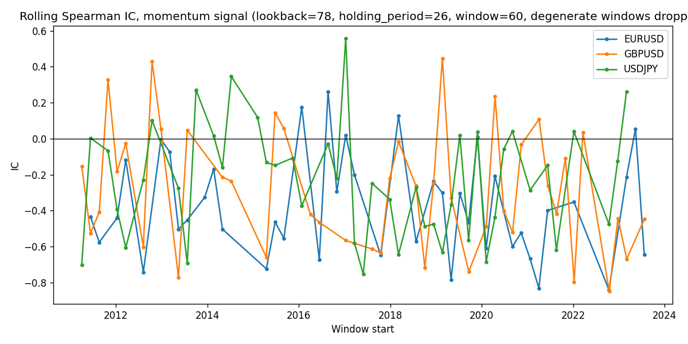

# Day 44 Research Audit: DataLoader + SignalBuilder Pipeline Test

## Question
Does the full pipeline — `DataLoader.load()` -> `SignalBuilder.compute()` ->
`compute_ic()` -> `compute_rolling_ic()` — actually run end-to-end on real
data, using a real signal from the strategy spec? This is a runnability
check, not a validation run; the prose below is intentionally short.

## Methodology
`research/applied_analysis/day44_pipeline_test.py`. Ran the momentum leg
(`src/signals/momentum.py`, `lookback=78`, one quarter per Section 4 of the
strategy spec) through `SignalBuilder` on all 3 supported pairs, real daily
closes 2011-01-02 to 2023-12-29 via `DataLoader`, `holding_period=26`
(Section 10's shared validation horizon). No regime gating, no
walk-forward — those are put off for a later date.

## Findings

| Pair | N obs | Pooled IC | Rolling IC (n=60) mean | % windows negative | Causal check |
|---|---|---|---|---|---|
| EURUSD | 4056 | 0.0149 | -0.3763 | 36/42 | pass |
| GBPUSD | 4055 | 0.0505 | -0.2854 | 34/44 | pass |
| USDJPY | 4056 | 0.0835 | -0.2337 | 33/45 | pass |

Pipeline ran clean on all 3 pairs; `validate_no_lookahead` passed on the
causal momentum signal.

Two things surfaced along the way that aren't just "OK" checkmarks:

1. **`compute_rolling_ic` was silently NaN-padding degenerate windows.**
   With `window=60` against a 78-day-lookback signal, ~33% of windows never
   see the signal change sign, so correlation is undefined
   (`ConstantInputWarning`). Fixed `SignalBuilder.compute_rolling_ic` to skip
   those windows instead of padding NaN; covered by
   `test_rolling_ic_skips_constant_signal_windows`.

2. **Rolling IC is systematically negative even after that fix** (see table),
   most likely a methodology artifact, not a real effect. Forward returns
   are ~0.95 lag-1 autocorrelated (overlapping `holding_period=26` labels
   via 1-day-stepping `.shift(-26)`), so a 60-bar window's "60 observations"
   aren't close to 60 independent bets — closer to comparing two smoothed
   trend lines over one or two cycles. `compute_rolling_ic` has no
   breadth/overlap correction, unlike the pooled IC path.

## Alternative explanations
Rolling IC could reflect a genuine short-horizon reversal effect layered on
top of the longer momentum trend, rather than pure autocorrelation
artifact — not ruled out here, just judged less likely given the magnitude
and the lag-1 autocorrelation evidence. Not separately tested.

## Next steps
- Pooled IC here is the wrong quantity for the actual hypothesis test
  (Section 1, item 1 requires *conditional* IC within the turbulent regime,
  not unconditional/pooled) — expect no read-through to strategy validity
  from these numbers.
- WalkForward Validation will reuse `purged_cross_validation`
  (`src/evaluation/cross_validation.py`), which already handles label
  overlap via embargo/purge — don't let naive walk-forward windows repeat
  the rolling-IC overlap problem found here.
- `compute_rolling_ic`'s `window` should be chosen relative to a signal's
  own timescale going forward, not fixed at 60 by convenience.

